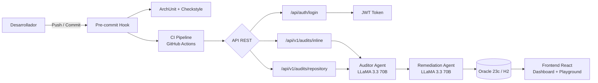
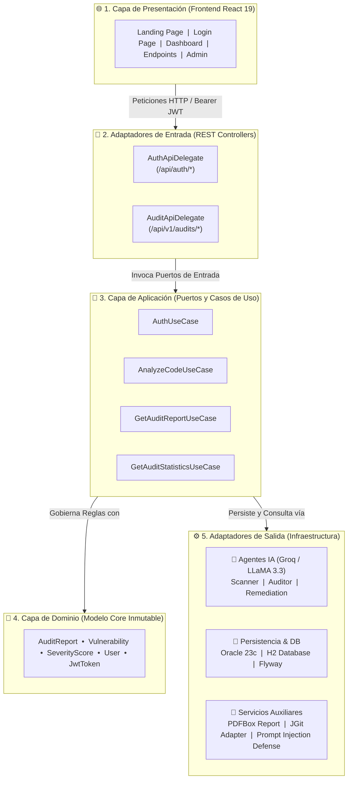
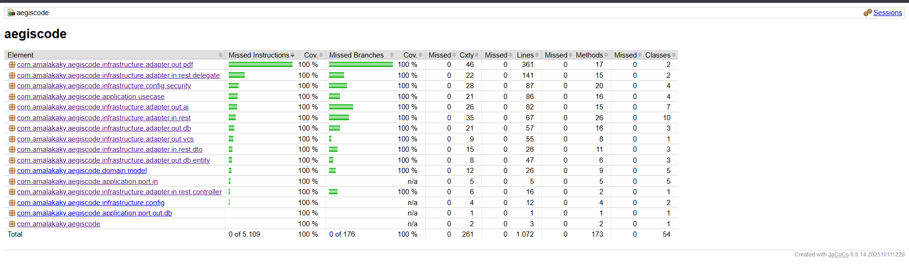
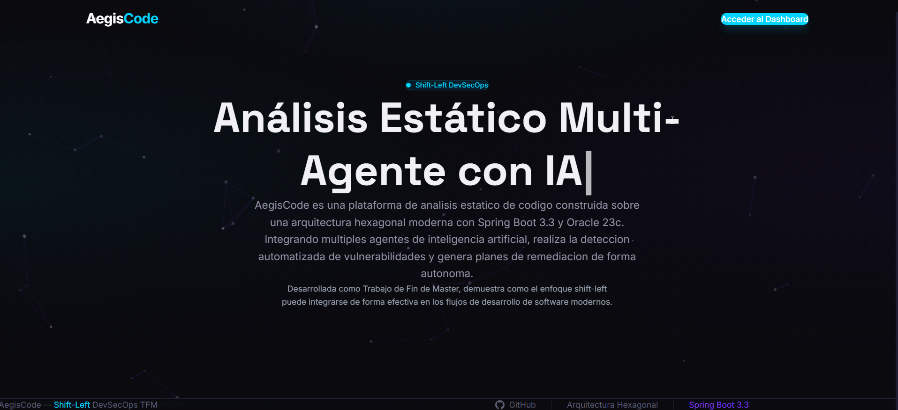
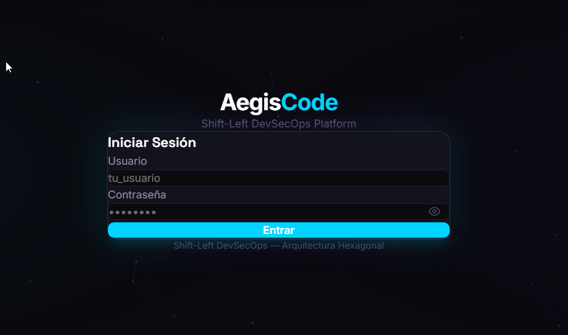
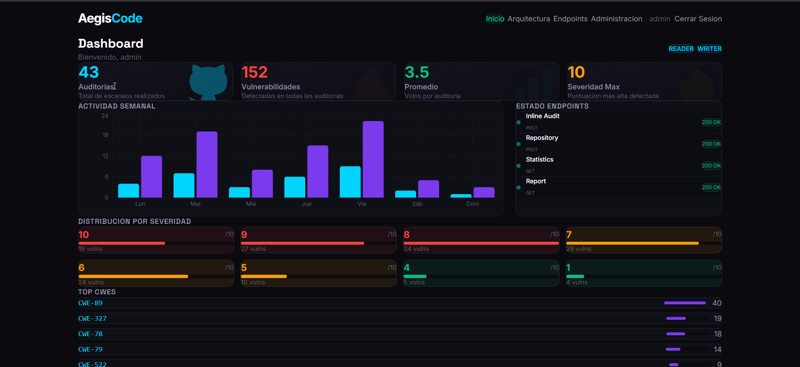
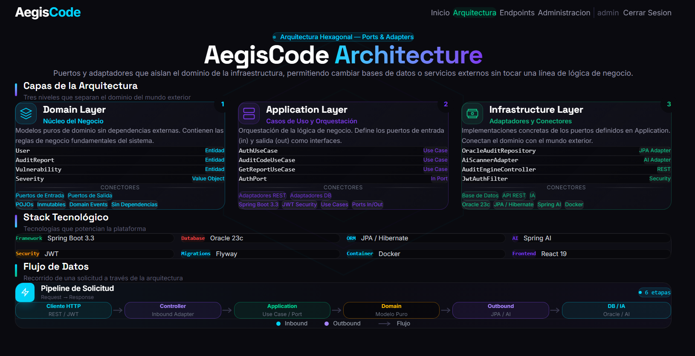
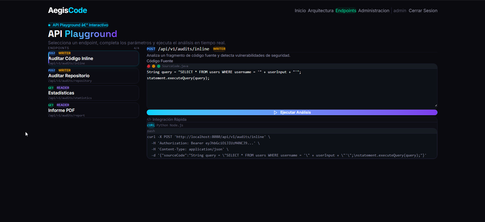
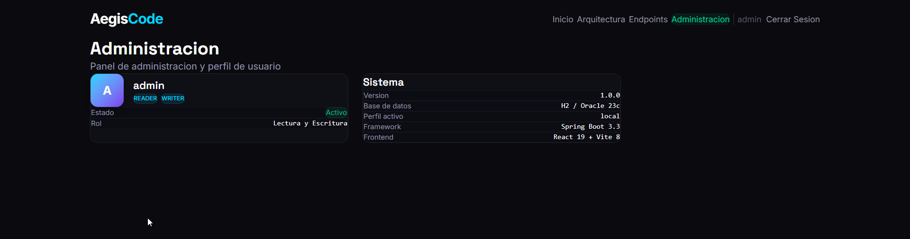

# 🛡️ AegisCode AI — Shift-Left DevSecOps Platform

[](https://jdk.java.net/21/)
[](https://spring.io/projects/spring-boot)
[](https://spring.io/projects/spring-ai)
[](https://www.oracle.com/database/)
[](https://www.h2database.com/)
[](https://react.dev/)
[](https://vitejs.dev/)
[](https://tailwindcss.com/)
[](https://www.typescriptlang.org/)
[](#-autenticación-y-autorización-jwt)
[](#-generación-de-informes-pdf)
[](https://www.archunit.org/)
[](#-seguridad-por-capas)
[](https://www.jacoco.org/)
[](#-descripción-general)

---

## 📋 Descripción General

Plataforma DevSecOps basada en una arquitectura multi-agente de Inteligencia Artificial. Diseñada para integrarse en etapas tempranas del ciclo de desarrollo (*Shift-Left*), interceptando, auditando y refactorizando código vulnerable mediante técnicas de *Clean Code* de forma totalmente automatizada.

**AegisCode AI** combina un motor backend robusto en Spring Boot 3.3 con la potencia de LLMs de última generación (LLaMA 3.3 70B vía Groq). Cuenta con **autenticación JWT**, un **frontend interactivo en React 19** con dashboard analítico, API playground y control de acceso basado en roles (**READER**, **WRITER**, **ADMIN**).

> 🎓 **Este proyecto constituye el Trabajo de Fin de Máster (TFM).**  
> **Programa:** Máster en Desarrollo con IA



---


## 👤 Credenciales de Acceso (Evaluación TFM)

Para evaluar el sistema, puede registrar un usuario vía API o utilizar el usuario administrador por defecto:

### Tabla de Permisos por Rol
| Rol | Permisos y Endpoints Accesibles |
| :--- | :--- |
| **ADMIN** | Acceso total a administración, métricas y auditorías. |
| **WRITER** | Ejecución de auditorías inline (`/inline`) y análisis de repositorios (`/repository`). |
| **READER** | Lectura de estadísticas (`/statistics`) y descarga de informes PDF (`/report`). |

---

## 🛠️ Stack Tecnológico

### Backend (Spring Boot Core)
| Capa / Componente | Tecnología | Versión / Detalle |
| :--- | :--- | :--- |
| **Lenguaje** | Java | JDK 21 |
| **Framework Base** | Spring Boot | 3.3.0 |
| **IA / LLM** | Spring AI + Groq LPU | 1.0.0-M1 (`llama-3.3-70b-versatile`) |
| **Base de Datos (Prod)** | Oracle Autonomous DB | 23c (Oracle Cloud - ATP) |
| **Base de Datos (Local)** | H2 Database | Modo compatibilidad PostgreSQL / Oracle |
| **Migraciones DB** | Flyway | 5 migraciones SQL automatizadas |
| **ORM / Persistencia** | Spring Data JPA / Hibernate | 6.x |
| **Seguridad** | Spring Security + JWT | `jjwt` 0.12.6 |
| **Rate Limiting** | Bucket4j | 8.10.1 |
| **Operaciones Git** | Eclipse JGit | 6.10.0 |
| **Generación PDF** | Apache PDFBox | 3.0.1 |
| **Arquitectura Clean** | ArchUnit | 1.3.0 |
| **Documentación API** | OpenAPI 3.0 + Swagger UI | `springdoc-openapi` 2.5.0 |

### Frontend (`landing/`)
| Componente | Tecnología | Versión |
| :--- | :--- | :--- |
| **Framework UI** | React | 19.2.7 |
| **Lenguaje** | TypeScript | ~6.0.2 |
| **Bundler** | Vite | 8.1.1 |
| **Estilos** | Tailwind CSS | 4.3.3 |
| **Animaciones** | Framer Motion | 12.42.2 |
| **Gráficas** | Recharts | 3.10.1 |
| **Fondo Interactivo** | tsParticles | 4.3.2 |
| **Router** | React Router DOM | 7.18.1 |

---

## 🏗️ Arquitectura Hexagonal + DDD

El diseño del backend sigue estrictamente los principios de **Arquitectura Hexagonal (Ports & Adapters)** combinados con **Domain-Driven Design (DDD)**. La capa de dominio es inmutable y agnóstica de frameworks.



---

## 🚀 Instalación y Ejecución Paso a Paso

### Requisitos Previos
* **JDK 21+** (Temurin recomendado).
* **Git** (se recomienda **Git Bash** en entornos Windows).
* **Node.js 20+** y **npm**.
* **Clave de API de Groq** (Gratuita en Console Groq).

### 1. Clonar el Repositorio
```bash
git clone -b main https://github.com/4M4L4K4Ky/Shift-Left.git
cd Shift-Left
```

### 2. Configurar Pre-commit Hook (OBLIGATORIO)
El proyecto incluye una barrera de calidad local previa a cualquier `commit`. Al estar ubicada en `.githooks/pre-commit`, **cada desarrollador que clone el repositorio debe activarla manualmente** una sola vez ejecutando:

```bash
git config core.hooksPath .githooks
```

Esto redirige a Git para que ejecute los hooks almacenados en el directorio `.githooks/` en lugar de la carpeta predeterminada `.git/hooks/`.

#### ¿Qué ejecuta automáticamente el hook en cada `git commit`?
El script utiliza `#!/bin/sh` y desencadena la siguiente secuencia:
1. `./mvnw clean test -Dtest=HexagonalArchitectureTest`: Verifica que ninguna regla de aislamiento de la arquitectura hexagonal haya sido violada mediante ArchUnit.
2. `./mvnw checkstyle:check`: Verifica el cumplimiento de las reglas estáticas innegociables:
    * **Máximo 1 `return` por método.**
    * **Máximo 3 sentencias `if` por método.**
    * **0 números mágicos** (uso obligatorio de constantes o enums).

> ⚠️ **Comportamiento y S.O.:** Si alguna prueba o regla estática falla, el commit **se aborta inmediatamente** impidiendo que código no conforme llegue al repositorio. En sistemas **Windows**, es indispensable ejecutar los comandos desde **Git Bash** o la terminal de IntelliJ con entorno WSL.

---

### 3. Variables de Entorno
```bash
export GROQ_API_KEY="gsk_tu_api_key_aqui"
export TOKEN="github_pat_tu_token_aqui"
export JWT_SECRET="clave_secreta_para_jwt_de_al_menos_256_bits"
```

### 4. Compilar Backend y Frontend
```bash
# Frontend
cd landing
npm install
npm run build
cd ..

# Backend
./mvnw clean compile
```

### 5. Ejecutar Pruebas (Unitarias + Arquitectura)
```bash
./mvnw clean verify
```

### 6. Arrancar el Servidor (Entorno Local H2)
```bash
./mvnw spring-boot:run -Dspring-boot.run.profiles=local \
  -Dspring-boot.run.jvmArguments="-Djava.net.preferIPv4Stack=true"
```
El servidor backend y la aplicación web integrada estarán disponibles en: **`http://localhost:8080`**.

---

## 🔒 Seguridad por Capas (DevSecOps)

1. **Defensa contra Prompt Injection:** `PromptInjectionDefense` sanitiza la entrada enviada al LLM descartando instrucciones maliciosas e imponiendo delimitadores estrictos `[INICIO_CODIGO_FUENTE]` y `[FIN_CODIGO_FUENTE]`.
2. **Row Level Security (RLS) en Base de Datos:** Las migraciones Flyway inyectan políticas de seguridad a nivel de motor SQL:
   ```sql
   ALTER TABLE audit_reports ENABLE ROW LEVEL SECURITY;
   CREATE POLICY deny_anon_audit ON audit_reports FOR ALL TO anon, authenticated USING (false);
   ```
3. **Rate Limiting:** Control de cuota vía Bucket4j limitando a un máximo de 5 peticiones por minuto en análisis pesados.
4. **JWT & Passwords:** Hash de contraseñas mediante **BCrypt** y firma de tokens JWT HMAC-SHA256 con expiración de 24 horas.

---

## 🧪 Gobernanza y Calidad de Código
[](#-gobernanza-y-calidad-de-código)

El proyecto aplica reglas estrictas de calidad en tiempo de compilación y ejecución:

* **Retorno Único:** Máximo un (1) `return` por método.
* **Complejidad Ciclomática:** Máximo tres (3) sentencias `if` por método.
* **Cero Números Mágicos:** Uso obligatorio de constantes `static final` o enumerados.
* **Aislamiento de Arquitectura (ArchUnit):**
  ```java
  @ArchTest
  static final ArchRule domain_should_be_isolated =
      noClasses().that().resideInAPackage("..domain..")
          .should().dependOnClassesThat().resideInAnyPackage(
              "..infrastructure..", "..application..", "org.springframework..");

  ```

---

## 📁 Estructura del Repositorio

```text
Shift-Left/
├── landing/                              ← 🖥️ Frontend React 19 + Vite + Tailwind v4
│   ├── src/
│   │   ├── pages/                        ← Landing, Dashboard, Architecture, Endpoints, Admin
│   │   ├── components/                   ← Componentes UI, Hero, Partículas, Navbar
│   │   └── contexts/AuthContext.tsx       ← Gestión de estado JWT y autenticación
├── .githooks/                            ← 🛡️ Pre-commit hook local (ArchUnit + Checkstyle)
│   └── pre-commit
├── src/main/java/com/amalakaky/aegiscode/
│   ├── domain/model/                     ← 🧱 Entidades de Dominio (AuditReport, Vulnerability, User)
│   ├── application/                      ← 🎯 Puertos (In/Out) y Casos de Uso
│   └── infrastructure/                   ← 🔌 Adaptadores REST, JPA, AI (Groq), Security, PDF
├── src/main/resources/
│   ├── application-local.yml             ← Configuración perfiles H2 local
│   ├── application-prod.yml              ← Configuración Oracle 23c Cloud
│   └── db/migration/                     ← 🗄️ Migraciones Flyway (V1..V5)
└── pom.xml                               ← Configuración Maven + Plugins (JaCoCo, ArchUnit)
```
## 📸 Capturas de la Aplicación

| Landing Page | Login |
|:---:|:---:|
|  |  |

| Dashboard Analítico | Arquitectura Hexagonal |
|:---:|:---:|
|  |  |

| API Playground | Panel de Administración |
|:---:|:---:|
|  |  |
---

## 🔍 Ejemplo de Auditoría Real

### Input — Código vulnerable enviado al agente

```java
String query = "SELECT * FROM users WHERE username = '" + userInput + "'";
statement.executeQuery(query);
```

### Output — Respuesta del agente auditor

- **Vulnerabilidad detectada:** CWE-89 — SQL Injection
- **Severidad:** 10/10
- **Remediación aplicada:** Uso de `PreparedStatement` con parámetros enlazados

### Código refactorizado por el agente de remediación

```java
String query = "SELECT * FROM users WHERE username = ?";
PreparedStatement stmt = connection.prepareStatement(query);
stmt.setString(1, userInput);
stmt.executeQuery();
```
## 🧠 Decisiones de Arquitectura

### ¿Por qué LLaMA 3.3 70B vía Groq y no GPT-4 o Claude?
- **Groq LPU** ofrece inferencia significativamente más rápida que las APIs tradicionales, crítico para análisis en tiempo real dentro de un pipeline CI/CD.
- LLaMA 3.3 70B es open-weight, lo que permite reproducibilidad del TFM sin dependencia de APIs propietarias de pago.
- La integración vía **Spring AI** abstrae el proveedor, permitiendo sustituirlo sin tocar lógica de negocio.

### ¿Por qué Arquitectura Hexagonal y no capas tradicionales?
- El dominio permanece **agnóstico de frameworks**: si Spring Boot cambia de versión o se sustituye Oracle por PostgreSQL, el núcleo de negocio no se toca.
- Facilita el **testing unitario puro** del dominio sin levantar contexto de Spring.
- ArchUnit verifica en tiempo de compilación que ningún adaptador viola el aislamiento del dominio.

### ¿Por qué dos bases de datos (H2 + Oracle 23c)?
- **H2** permite ejecutar el proyecto localmente sin infraestructura externa, reduciendo la barrera de entrada para evaluación.
- **Oracle 23c** en Cloud (ATP) es el entorno de producción real con Row Level Security a nivel de motor SQL.


© 2026 — **AegisCode AI TFM** | Máster en Desarrollo con IA | Shift-Left DevSecOps
